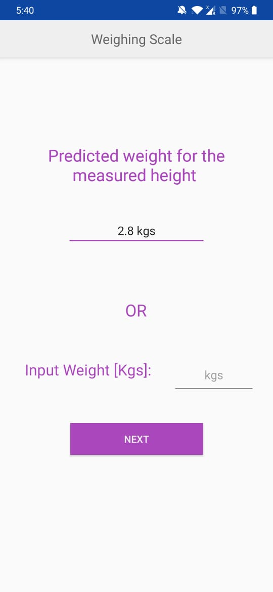
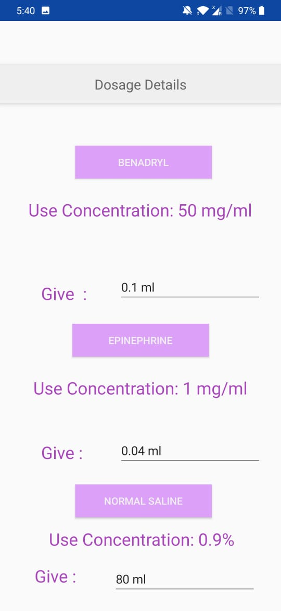
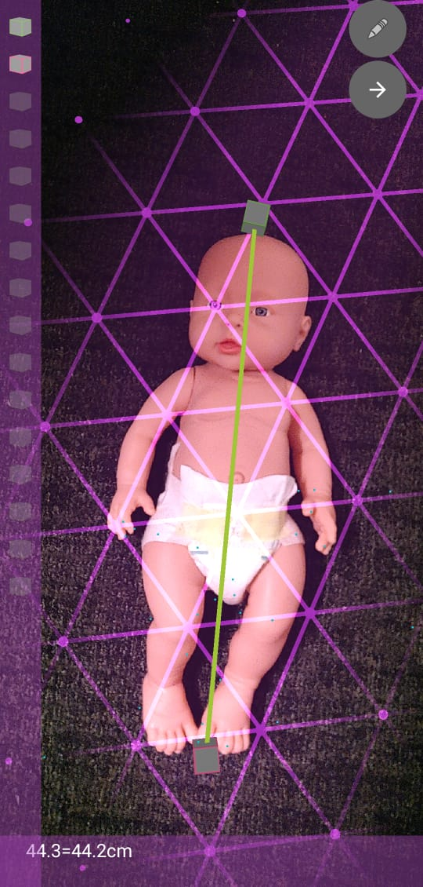

 # Pedi-Pod

AR Based Broselow Tape

Project Video: https://www.youtube.com/watch?v=mTQTxxgVz_M

## Inspiration

We were inspired by noticing that a hospital in rural India was using outdated methods to measure babies weights in the emergency department in unhygienic conditions.

## What it does

It is an AR based, no internet solution for emergency physicians to quickly administer the right dose of medication to pediatric patients by estimating height and weight through a mobile device. It also helps the parents have a track of their child's growth using the same app.

## How we built it

We first tried integrating Google ARCore and measure height on an Android platform. On successful measurement of height, we tried of using the traditional method of weight estimation based on height and then determine the approximate dosage for the pediatric patients. We used contour estimation in openCV to measure the surface area of the baby and hence used the height and surface area to predict body weight. We also used machine learning on Microsoft Azure to ensure that the child's growth rate is ideal.

## Challenges we ran into

Mentors at Stanford who had researched on this issue spoke about the limitations of the currently existing solutions such as the Broselow tape. We had to look for more accurate measures to improve upon the conventional measures. Therefore we tried exploring another 5-6 models and found BSA based model to be more accurate when compared to the others. BSA model is based on Body Surface Area and Haycock formula to estimate the weight accurately based on height which we measure accurately.

## Accomplishments that we're proud of

We are proud of having a diverse group of team members consisting of two engineers, a business student, and a pharmacist. We had several brain storm sessions throughout the duration of the hackathon. Having multiple point of views for this project has led us to success.

## What we learned

We learned that a problem well identifies is a problem half solved and that team diversity is of utmost importance in building a fool proof product to align with the increasingly competitive market.

## What's next for Pedi-Pod

Pedi-Pod needs to be validated for accuracy. Additionally, we need to explore other methods of accurately determining a baby's weight and hence the dosage. We plan to augment the results using machine learning models to get a more accurate picture of patient’s weights in different areas of the world.

## Built With

- ar
- arcore
- azure
- firebase
- java
- machine-learning
- numpy
- opencv
- pada
- python

